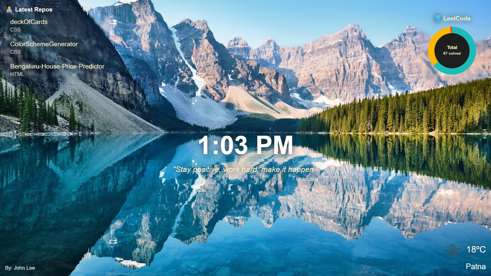

## 🌄 Personal Dashboard

Personal Dashboard is a modern, interactive new-tab dashboard extension built using HTML, CSS, and Vanilla JavaScript.
It replaces your browser’s new tab with a clean, motivational dashboard showing live time, weather, GitHub activity, LeetCode progress, quotes, and dynamic nature backgrounds.
Designed for productivity, learning motivation, and a minimal aesthetic.

---

## 🌟 Features

- **🌅 Dynamic Nature Backgrounds**:Fetches a random high-quality nature image from Unsplash on each new tab.
- **🧑‍💻 GitHub Integration**: Shows your **latest 3 repositories** with names, links, and programming languages.
- **📘 LeetCode Progress Visualization**: Interactive SVG donut chart showing Easy, Medium, and Hard problems solved.
Hovering over each section updates the center with category-wise stats.
- **💬Inspirational Quotes**: Fetches a random motivational quote from [ZenQuotes](https://zenquotes.io/).
- **🌦 Local Weather**: Shows current weather based on your geolocation using OpenWeatherMap API.
- **⏰ Live Clock**: Displays the current time with live updates every second.
- **🔗 Photo Credits**
Clicking the author name opens the photographer’s Unsplash profile.

---

## 🖥️ Demo
---

This project is designed to work as:
- A Chrome New Tab extension
- A standalone web dashboard
>Simply open a **new tab** after installing the extension to see it in action.

---

## 🛠️ Technologies Used
---

- HTML5 & CSS3 – Layout, styling, and responsive design
- Vanilla JavaScript (ES6+) – Application logic and API handling
- SVG – Interactive LeetCode donut chart
- Fetch API – Data retrieval from external APIs

APIs Used
- Unsplash API – Random nature backgrounds
- GitHub REST API – Latest repositories
- LeetCode Stats API (Unofficial) – Problem-solving statistics
- ZenQuotes API – Motivational quotes
- OpenWeatherMap API – Weather data

---

## ⚙️ Customization 
---

- You can easily personalize the dashboard:
- Change the GitHub username in index.js
- Update the LeetCode username to show your own stats
- Modify the Unsplash search query for different background themes
- Replace the quotes API with another provider
- Adjust colors, layout, and animations in index.css

---

## 🔒 Privacy & Permissions 
---

- This extension does not collect, store, or transmit personal data
- All data is fetched directly from public APIs and stays on the user’s - device
- Location access is used only to display local weather.

⚠️ Notes
- GitHub API requests may be rate-limited for unauthenticated users
- Location permission is required for the weather widget
- An active internet connection is needed for dynamic content

---
## 🚀 Installation (Local)
--- 

- Clone this repository
- Open Chrome and go to chrome://extensions
- Enable Developer Mode
- Click Load unpacked and select the project folder
- Open a new tab 🎉

--- 
## 📌 License
---

- This project is open-source and free to use for personal and educational purposes.
- ⭐ If you found this project helpful, don’t forget to give it a star on GitHub!

---